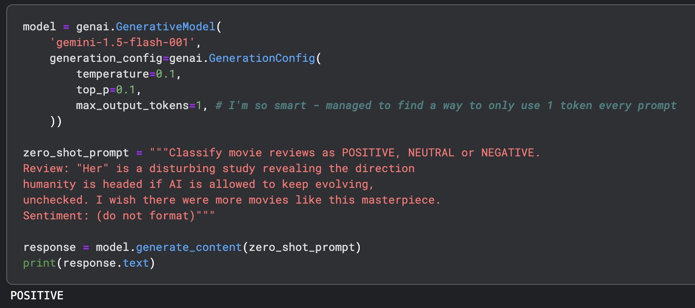
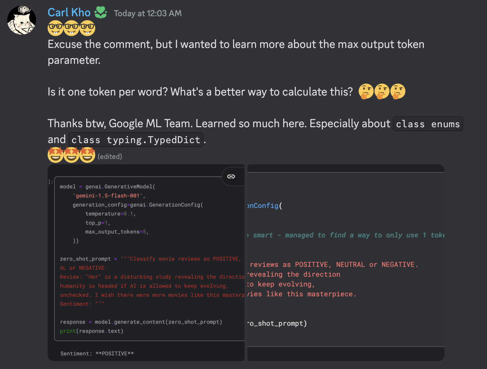

# Google_5-Day_Gen-AI-Course

Course by Google ML — Nov 11 → 15

## Foundational Models & Prompt Engineering

- [Foundational Models & Prompt Engineering - Video 1](https://www.youtube.com/watch?v=mQDlCZZsOyo)
- [Foundational LLM and Text Generation - Kaggle Whitepaper](https://www.kaggle.com/whitepaper-foundational-llm-and-text-generation)
- [Foundational Models & Prompt Engineering - Video 2](https://www.youtube.com/watch?v=F_hJ2Ey4BNc)
- [Prompt Engineering - Kaggle Whitepaper](https://www.kaggle.com/whitepaper-prompt-engineering)
- [Day 1 Prompting - Kaggle Notebook](https://www.kaggle.com/code/carlkho/day-1-prompting/edit)

## Carl's Learnings



### Top-K and Top-P for Beginners: Guiding the AI's Creativity

Imagine you're playing a game where you have to pick the next word in a sentence. You have a huge bag of words to choose from, but the game gives you clues.

**Top-K** (# of words, so ones to hundreds) is like looking at only the K most likely words in the bag. The higher the K, the more choices you have. If K is 1, you're stuck with only the most likely word - that's like greedy decoding.

**Top-P** (float 0.0 to 1.0) is like setting a limit on the total probability you want to consider. If you're only looking for a certain percentage of the most likely words, you use Top-P.

Here's a breakdown with examples:

#### Example 1: Top-K

**Sentence:** The cat sat on the ...

**Model's Top-5 Predictions:** (1) mat, (2) chair, (3) table, (4) bed, (5) couch

- **Top-K = 1 (Greedy Decoding):** The cat sat on the mat. (Only the most likely word is chosen.)
- **Top-K = 3:** The cat sat on the chair (or table, or bed). (The model randomly selects from the top 3 predictions.)

#### Example 2: Top-P

**Sentence:** The cat sat on the ...

**Model's Probabilities:**

- mat: 0.4
- chair: 0.3
- table: 0.15
- bed: 0.08
- couch: 0.07

- **Top-P = 0.7:** The cat sat on the mat (or chair). (The model considers only words that add up to 0.7 probability.)
- **Top-P = 1:** The cat sat on the mat (or chair, or table, or bed, or couch). (All words are considered.)

#### Combining Top-K and Top-P

If you use both Top-K and Top-P, the model first narrows down the possibilities to the top K words, and then applies the probability threshold from Top-P. This can make the model more focused and less likely to generate random or unexpected words.

#### Why use them?

Top-K and Top-P help you control the "creativity" of your AI model. A higher Top-K or Top-P means more options for the model, leading to more surprising or unpredictable outputs. A lower Top-K or Top-P makes the output more predictable and coherent.

#### Temperature

Imagine temperature as the AI's "confidence". A higher temperature makes the AI more willing to experiment with less likely words, even if they seem unusual. A lower temperature makes the AI more conservative, sticking to the most predictable options.

By using Top-K, Top-P, and temperature, you can fine-tune your AI model's output for your specific needs, whether you want predictable summaries, creative stories, or something in between.

_________

## Example Classes

```python
import typing

class PizzaOrder(typing.TypedDict):
    size: str
    ingredients: list[str]
    type: str

import enum

class Sentiment(enum.Enum):
    POSITIVE = "positive"
    NEUTRAL = "neutral"
    NEGATIVE = "negative"

model = genai.GenerativeModel(
    'gemini-1.5-flash-001',
    generation_config=genai.GenerationConfig(
        response_mime_type="text/x.enum",
        response_schema=Sentiment
    ))

response = model.generate_content(zero_shot_prompt)
print(response.text)


# Question
