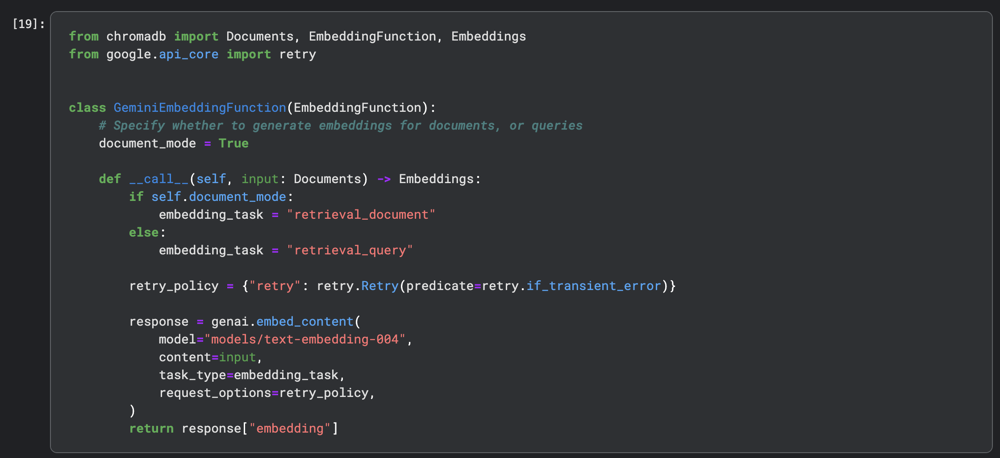
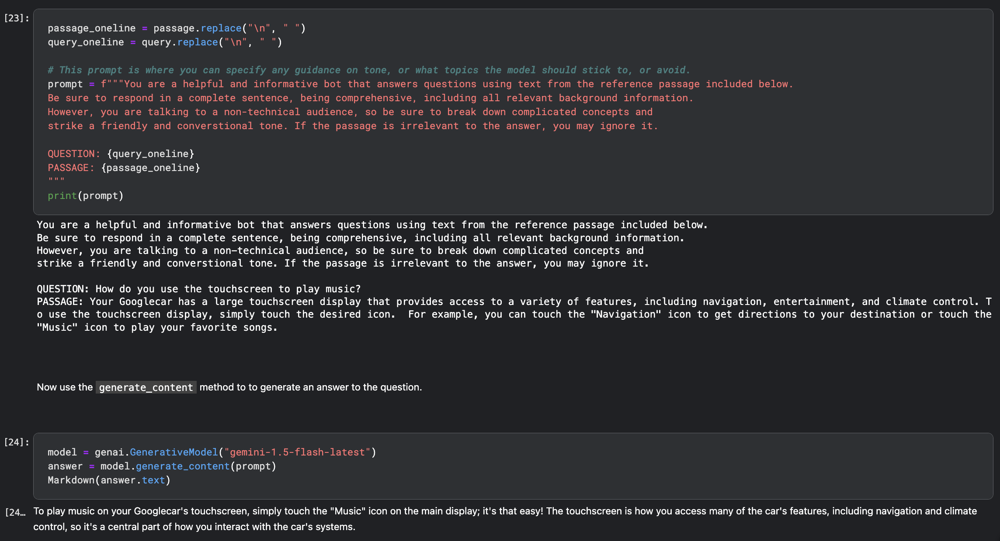
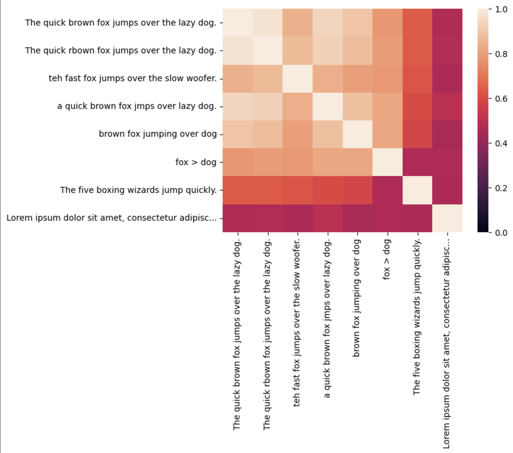
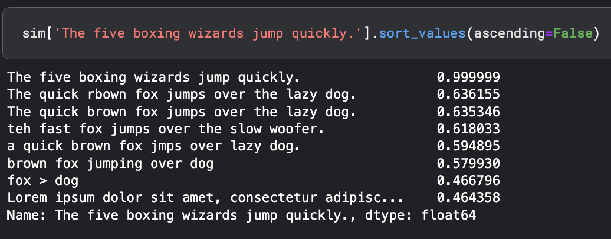

# My Day 2 Learnings and Contributions

This document summarizes my key learnings and contributions from Day 2, focusing on Retrieval-Augmented Generation (RAG), embeddings, similarity scores, and building a text classification model with Keras.

## RAG and ChromaDB

* **RAG Concept:** Refreshed my understanding of RAG and its applications.
* **TextEmbedding004:** Learned about the latest TextEmbedding004 model.
* **`__call__` Method:** Explored using the `__call__` method for creating callable classes.
* **ChromaDB Usage:**  Learned about setting `document_mode=True` for streamlined operations, using `db.count` and `peek` methods, and the importance of f-strings for debugging prompts and referencing passages.
* **ChromaDB Limitations:** Noted that ChromaDB doesn't inherently provide AI response generation capabilities.
* **Augmented Generation:** Learned the term "augmented generation" for rephrasing and enriching responses.
* **Refactoring:** Emphasized the importance of refactoring for efficient workflows.
* **Future Exploration:**  Plan to delve deeper into retry policies for transient errors and experiment more with augmented generation strategies.

## Embeddings and Similarity Scores

* **TextEmbedding Function:** Learned about the semantic similarity task type within Gemini AI's GenAI embed content function.
* **Cosine Similarity Visualization:** Found the visualization of cosine similarity insightful, particularly using Seaborn heatmaps.
* **Linear Algebra Connection:** Connected cosine similarity to linear algebra concepts like Markov matrices and the PageRank algorithm.
* **Future Exploration:** Plan to further explore the mathematical intuition behind cosine similarity and its connection to matrix operations.

> A similarity score of two embedding vectors can be obtained by calculating their inner product. If $\mathbf{u}$ is the first embedding vector, and $\mathbf{v}$ the second, this is $\mathbf{u}^T \mathbf{v}$. As these embedding vectors are normalised to unit length, this is also the cosine similarity. This score can be computed across all embeddings through the matrix self-multiplication: `df @ df.T`. Note that the range from 0.0 (completely dissimilar) to 1.0 (completely similar) is depicted in the heatmap from dark (0.0) to light (1.0).

## Text Classification with Keras and Embeddings

* **TextEmbedding004 Capabilities:** Explored various task types supported by TextEmbedding004, including retrieval query, retrieval documents, semantic similarity, classification, clustering, and fact verification.

### Task types

The `text-embedding-004` model supports a task type parameter that generates embeddings tailored for the specific task.

Task Type | Description
---       | ---
RETRIEVAL_QUERY | Specifies the given text is a query in a search/retrieval setting.
RETRIEVAL_DOCUMENT | Specifies the given text is a document in a search/retrieval setting.
SEMANTIC_SIMILARITY | Specifies the given text will be used for Semantic Textual Similarity (STS).
CLASSIFICATION | Specifies that the embeddings will be used for classification.
CLUSTERING | Specifies that the embeddings will be used for clustering.
FACT_VERIFICATION | Specifies that the given text will be used for fact verification.

### Key Contributions

* **Preprocessing and Embeddings:** Preprocessed 20,000 datasets and created optimized embeddings for classification.
* **Keras Model Building:** Built a classification model using Keras with raw embeddings as input, one hidden layer, and an output layer for class probabilities. Used 20 epochs and a batch size of 32.  Keras handled shuffling, metrics calculation, and other boilerplate tasks.
* **Training and Performance:**  Loss reduced significantly during training. Achieved 94% accuracy on the test dataset with a 22% loss.
* **Custom Prediction:** Tested custom predictions on various topics and observed high accuracy, particularly for space-related news (99.27%).
* **Key Takeaways:** Keras simplifies ML workflows. TextEmbedding004 is versatile. High accuracy requires careful parameter tuning and early stopping.
* **Future Exploration:** Plan to explore fact verification tasks, experiment with larger datasets and more complex models, and investigate the high accuracy observed for specific predictions.
